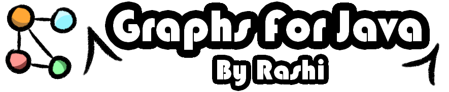

# 🌐 Graph Algorithms and Utilities

This project provides a collection of **Java implementations of graph algorithms and utilities**, designed for learning, experimentation, and integration into larger projects.

## 📦 What's inside?

**Nodes:**

Core building blocks for all graph structures:

- **Node** → Represents a vertex in the graph.
- **Edge** → Represents a connection between two nodes (directed or undirected) with optional weights.

**Graphs:**

Fully implemented graph structures with support for:

- **Directed and Undirected Graphs**.

- **Weighted and Unweighted Graphs**.

- **Adjacency and Cost Matrices**.

- Automatic construction from nodes, adjacency, or cost matrices.

**Algorithms:**

Implemented algorithms include:

- **Graph Traversals:**

  - **DFS (Depth-First Search)** → Explore paths deeply first.

  - **BFS (Breadth-First Search)** → Explore neighbors level by level.

-**Shortest Path Algorithms:**

  - **Dijkstra** → Single-source shortest paths (non-negative weights).

  - **Bellman-Ford** → Single-source shortest paths (supports negative weights and cycle detection).

  - **Floyd–Warshall** → All-pairs shortest paths with path reconstruction.

- **Minimum Spanning Tree (MST) Algorithms:**

  - **Prim** → Greedy algorithm for MST (weighted, undirected graphs).

  - **Kruskal** → Greedy algorithm using Union-Find (weighted, undirected graphs).

- **Connectivity Analysis:**

  - Checks if a graph is connected, strongly connected, or weakly connected.

  - Computes connected components and their sizes.

## 🚀 Features

- Implemented in **pure Java**, no external dependencies.
- Supports **directed**, **undirected**, **weighted**, and unweighted graphs.
- Educational: great for students and developers learning graph algorithms.
- Includes advanced features like **MST, shortest paths, and connectivity analysis**.

## 💻 Code Examples

- **Graph Construction from Adjacency Matrix:**
```java
int[][] adjacency = {
    {0, 1, 0},
    {1, 0, 1},
    {0, 1, 0}
};

Graph g = new Graph(adjacency, false, false); // undirected, unweighted
g.printGraph();
g.printAdjacencyMatrix();


// DFS and BFS Traversals:

g.runDFS(0);
g.runBFS(0);
```

- **Shortest Path Algorithms:**
```java
// Given a cost matrix...

Graph weightedGraph = new Graph(costMatrix, true, true, true); // directed, weighted
weightedGraph.runDijkstra(0);
weightedGraph.runBellmanFord(0);
weightedGraph.runFloydWarshall();
```

- **Minimum Spanning Tree:**
```java
// Given a cost matrix...

Graph mstGraph = new Graph(costMatrix, false, true, true); // undirected, weighted
mstGraph.runPrim(0);
mstGraph.runKruskal();
```
## 📊 Lessons Learned

Developing this project strengthened my understanding of:

- **Graph representation** and manipulation (adjacency vs cost matrices, nodes/edges).

- **Classic graph algorithms** and their use cases.

- **Algorithm design and optimization** in Java.

- **Analyzing graph connectivity** and handling multiple components.

## Feedback

I’d love to hear your thoughts or suggestions to improve this project.
Feel free to reach out at **rashosubs@gmail.com** or open an issue in the repository.

## Author

- [@RasHOSub5](https://github.com/RasHOSub5)
